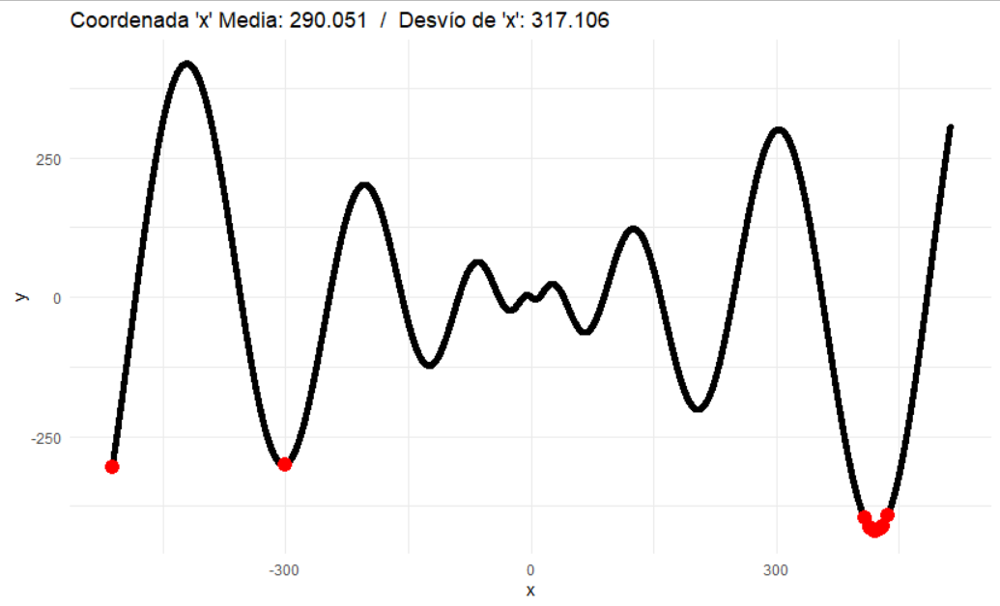
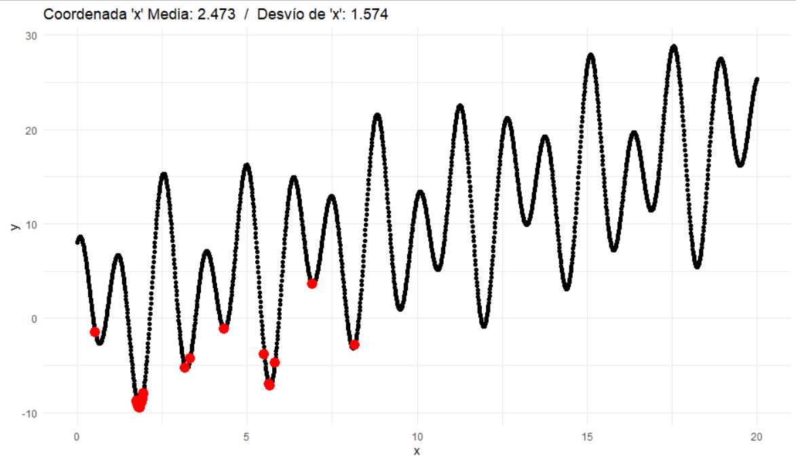
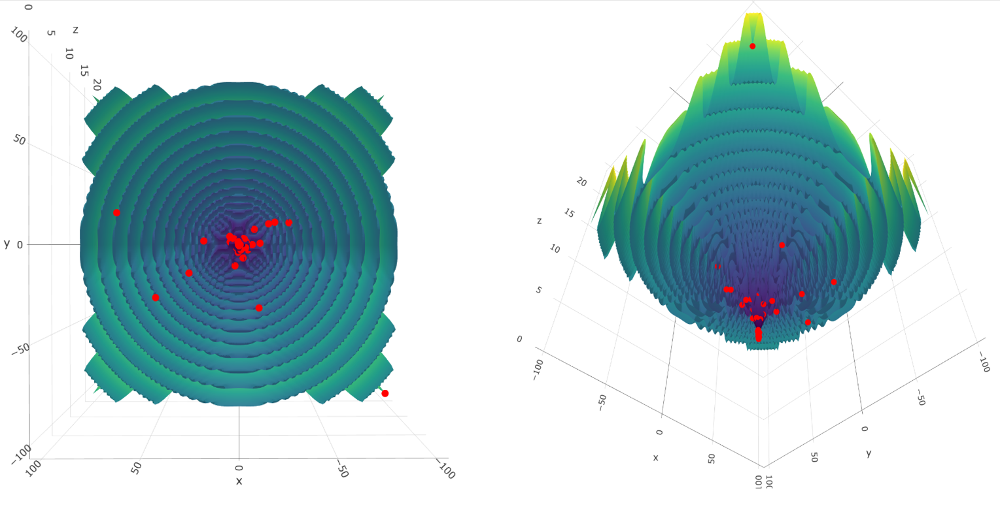

# Algoritmos genéticos

Se diseña un algoritmo para encontrar valores óptimos en funciones mediante la técnica de algoritmos genéticos. Trabaja con cromosomas binarios, es decir, un vector (o una lista o fila en una matriz) con genes de valor 1 o 0 (bits). El primer gen de cada cromosoma de la población representa el signo de un número decimal, 1 significa que es un valor negativo y 0 positivo. Por defecto se agregan 10 genes al final del cromosoma para simular la fracción decimal del número (milésimas) y, en consecuencia, los restantes genes definen la fracción entera.

# Experimentos

### Función f(x) = -x*sin(√(|x|)) con x ∈[-512…512]

Se realizaron varias pruebas variando el tamaño de la población y los porcentajes de mutación y elitismo, manteniendo el resto constante. Se grafican en color rojo los puntos mínimos calculados.  

Se encontraron mínimos locales con un valor y = f(x) cercano al global, pero distantes a la magnitud de la variable x mínima global, por ejemplo, los valores -512 y -300. Por lo tanto, el promedio de todas las pruebas arrojó un valor x que no representa al valor mínimo global. Centrándonos en la zona del mínimo global se aprecia en la curva como alrededor de ésta hay varios puntos, teniendo en cuenta solo esas variables la media sí queda muy cercana al mínimo global y el desvío de los resultados es menor.

### Función f(x) = x + 5*sin(3x) + 8*cos⁡(5x) con x ∈[0…20]

La mayor cantidad de puntos se posicionaron en la zona del mínimo global, no obstante, dada la complejidad de la función el algoritmo devolvió varios mínimos locales, es decir, que fue más sensible a la variación de los parámetros respecto a la primera función estudiada.

 
### Función f(x,y) = (x^2 + y^2)^0.25 [sin^2*(50*(x^2 + y^2)^0.1) + 1] con x,y ∈[-100…100]

De manera similar a lo que sucedió con la función previa, la complejidad de la misma produjo variaciones significativas en algunos resultados, aunque en la mayoría de las pruebas alcanzaron valores bastantes cercanos al mínimo global.
 
	

